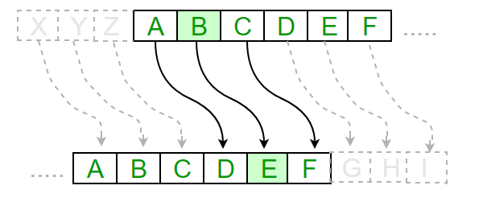

# caesar-cipher
This is the famous Caesar Cipher project to illustrate encryption and decryption.

  

## Author
Edwin Aringo.

## Contact
 * tedaringo628@gmail.com

## Technologies used
 * IntelliJ
 * Gradle 
 * Git
 * Java

## How it is used
Clone this repository into your local computer and run using preferred IDE. 
In the case of IntelliJ, build the application and run it.

## Licence 
* MIT licence.

